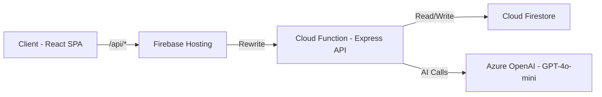

# SkillScout AI - Technical Skill Assessment Agent

SkillScout is a next-generation, AI-powered technical skill assessment platform. It allows users to upload a target Job Description and their current resume. The AI automatically maps the required skills, conducts a dynamic, conversational technical interview, and generates a comprehensive, week-by-week personalised learning roadmap to bridge any identified skill gaps.

**🔗 Live Demo:** [https://skillscout-server.web.app](https://skillscout-server.web.app)

## 📸 Screenshots


## 🌟 Core Features

- **Smart Document Parsing**: Instantly extracts required skills from Job Descriptions and aligns them with candidate resumes using Azure OpenAI (or Google Gemini in Guest Mode).
- **Dynamic Conversational Assessment**: A live, conversational interview interface that probes for depth and understanding rather than just testing trivia. Uses Server-Sent Events (SSE) for real-time AI streaming. Each skill is limited to **8 focused questions** for a comprehensive and deep assessment.
- **Voice Capabilities**: Native browser Web Speech API integration for **Text-to-Speech (TTS)** and **Speech-to-Text (STT)**, allowing users to practice verbal interviews.
- **Objective Scoring & Gap Analysis**: Scores demonstrated proficiency against job requirements on a 1-10 scale and identifies critical "Skill Gaps".
- **Personalised Learning Plans**: Generates week-by-week actionable roadmaps, curated resources, and quick wins to help candidates reach interview readiness.
- **Offline Guest Sandbox**: Fully functional offline client sandbox mode. Runs entirely in the browser, persisting all data to `localStorage`. No backend server or Azure credentials required to run.
- **Direct Gemini API Integration**: Enter your own Google Gemini API key to run real AI-driven assessments entirely client-side, with built-in auto-retry on free-tier rate limits.
- **Local Data Portability**: Export and import your local guest sandbox assessments as JSON files directly from the UI, bypassing browser storage limits.
- **Premium UI/UX**: A highly polished, mobile-responsive interface built with Tailwind CSS, Shadcn UI, and smooth micro-interactions.
- **PDF Export**: Downloadable, professional learning plan scorecards generated directly in the browser.
- **Serverless Architecture**: Fully deployed on Firebase (Cloud Functions + Hosting) for zero-maintenance scalability.

## 🛠️ Technology Stack

- **Frontend**: React 18, TypeScript, Vite, Tailwind CSS (v4), Shadcn/UI, Zustand (State Management with Persistence), Lucide Icons.
- **Backend**: Node.js, Express.js, TypeScript, Firebase Cloud Functions (2nd Gen).
- **Database**: Cloud Firestore (NoSQL).
- **AI Layer**: Azure OpenAI (`gpt-4o-mini`) via the OpenAI SDK.
- **Hosting**: Firebase Hosting + Cloud Functions.
- **File Handling**: In-memory PDF processing via `multer` + `busboy` (serverless-compatible).

## 📂 Project Structure

```text
skill-assessment-agent/
├── client/                 # React Frontend
│   ├── src/
│   │   ├── components/     # Reusable UI components (Chat, Progress, PDF)
│   │   ├── hooks/          # Custom React hooks (useSSE)
│   │   ├── lib/            # Axios config, Firebase client SDK
│   │   ├── pages/          # Main application views (Dashboard, Assessment, Results)
│   │   └── store/          # Zustand global state (useAuthStore, useAssessmentStore)
├── server/                 # Express Backend (Firebase Cloud Functions)
│   ├── src/
│   │   ├── controllers/    # Route handlers (Auth, Assessment, Chat)
│   │   ├── middleware/     # JWT Auth, Multer + Busboy upload
│   │   ├── models/         # Firestore data models (User, Assessment)
│   │   ├── routes/         # Express API routers
│   │   ├── services/       # Azure OpenAI service logic, PDF parser
│   │   ├── utils/          # AI prompts, SSE stream helpers
│   │   ├── firebase.ts     # Firebase client SDK initialisation
│   │   └── index.ts        # Cloud Function entry point
├── shared/                 # Shared TypeScript interfaces (Types)
├── firebase.json           # Firebase Hosting + Functions config
└── firestore.rules         # Firestore security rules
```

## 🚀 Getting Started

### Prerequisites
- Node.js (v18 or higher)
- Firebase CLI (`npm install -g firebase-tools`)
- A Firebase project on the [Blaze plan](https://firebase.google.com/pricing) (required for Cloud Functions)
- **An active Azure Subscription** with access to Azure OpenAI Service

### 1. Clone & Install
This is a monorepo containing both the `client` and `server` directories. Install dependencies for both:

```bash
# Install Server Dependencies
cd server
npm install

# Install Client Dependencies
cd ../client
npm install
```

### 2. Configure Azure OpenAI

To run the AI assessment, you must deploy an OpenAI model in Azure:
1. Go to the [Azure Portal](https://portal.azure.com/) and create an **Azure OpenAI** resource.
2. Go to [Azure AI Studio](https://oai.azure.com/) using your new resource.
3. Under **Deployments**, create a new deployment. Select the `gpt-4o-mini` model.
4. Note your **Endpoint**, **API Key**, and exactly what you named your **Deployment**.

### 3. Configure Guest Sandbox (Google Gemini & Offline Processing)

If you don't have an active Azure OpenAI subscription or want to try the application instantly without deploying the backend:
1. Click **Continue as Guest** on the login page to enter **Guest Sandbox Mode**.
2. The application will run entirely in your browser using local storage:
   - **Simulated Mode (No API Key)**: Walks you through the full assessment experience using realistic, pre-packaged mock responses.
   - **Live AI Mode (With Gemini API Key)**: Paste your personal Google Gemini API Key in the **Settings** menu. All resume parsing, interview questioning, scoring, and roadmap generation will be processed by Gemini directly from your browser.
3. To obtain a free Gemini API Key, follow our step-by-step [Gemini API Key Generation Guide](docs/gemini-key-guide.md).
4. **Data Portability**: Since guest assessments reside in `localStorage`, use the **Export** and **Import** features in the Settings menu to backup, restore, or migrate your data.

### 4. Configure Firebase

1. Create a Firebase project at [console.firebase.google.com](https://console.firebase.google.com/).
2. Enable **Cloud Firestore** (create a database in test mode).
3. Upgrade to the **Blaze plan** (pay-as-you-go — required for Cloud Functions).
4. Update `server/src/firebase.ts` and `client/src/lib/firebase.ts` with your Firebase project config.

### 5. Environment Variables

Create a `.env` file in **both** the `server` and `client` directories.

**`server/.env`**:
```env
# Authentication
# Generate secure random strings (e.g. openssl rand -hex 32)
JWT_SECRET=your_jwt_access_secret_here
JWT_REFRESH_SECRET=your_jwt_refresh_secret_here

# Client URL (for CORS)
CLIENT_URL=https://your-project.web.app

# Azure OpenAI Configuration
AZURE_OPENAI_ENDPOINT=https://your-resource-name.openai.azure.com/
AZURE_OPENAI_API_KEY=your_azure_openai_api_key_here
AZURE_OPENAI_API_VERSION=2025-01-01-preview
AZURE_OPENAI_DEPLOYMENT_NAME=gpt-4o-mini
```

> **Note:** Do NOT set a `PORT` variable — Firebase Cloud Functions manages the port internally.

**`client/.env`**:
```env
VITE_API_URL=/api
```

> The Vite dev server proxy (configured in `vite.config.ts`) forwards `/api` requests to the deployed Firebase Function URL during local development.

### 6. Running Locally

You only need to run the **frontend** dev server. The Vite proxy forwards API calls to the deployed Firebase Cloud Function:

```bash
cd client
npm run dev
```

The application will be available at `http://localhost:5173`.

### 7. Deploying to Firebase

```bash
# Build the client first
cd client
npm run build

# Deploy everything (functions + hosting)
cd ..
firebase deploy --project your-project-id
```

The live application will be at `https://your-project.web.app`.

## 🏗️ Architecture & Data Flow



1. **Phase 1 (Initialization & Parsing)**: The user uploads a Job Description (text) and a Resume (PDF). The server uses in-memory `multer`/`busboy` and `pdf-parse` to extract text. Azure OpenAI analyses both documents and identifies a matrix of required technical skills.
2. **Phase 2 (Conversational Assessment)**: The user enters the chat interface. The client connects to `GET /api/chat/:id/message` via Server-Sent Events (`EventSource`). The AI asks technical questions tailored to the user's resume, with a **max of 4 questions per skill** for focused assessments. Responses stream back chunk-by-chunk for a low-latency feel.
3. **Phase 3 (Scoring)**: Once all skills are assessed, the server passes the entire conversation transcript to Azure OpenAI, which acts as a technical recruiter to assign a 1-10 proficiency score for each skill.
4. **Phase 4 (Plan Generation)**: Based on the generated scores and identified "Skill Gaps", the AI generates a priority-ordered learning plan containing curated resources, week-by-week milestones, and practical project suggestions.
5. **Phase 5 (Results & Export)**: The client displays the roadmap interactively. Users can copy an executive summary or generate an on-the-fly PDF using `@react-pdf/renderer` to share with mentors or recruiters.

## 👨‍💻 Author

**Ritik Kumar**
- [GitHub: @RitikRK96](https://github.com/RitikRK96)
- [LinkedIn: Ritik Kumar](https://www.linkedin.com/in/ritikkumar08/)

## 📝 License
MIT License
